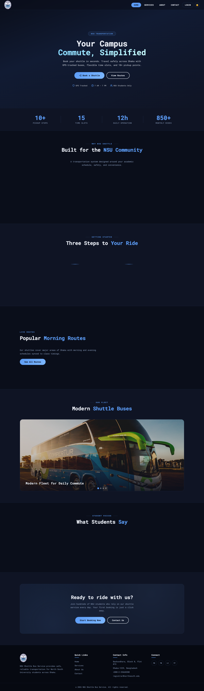
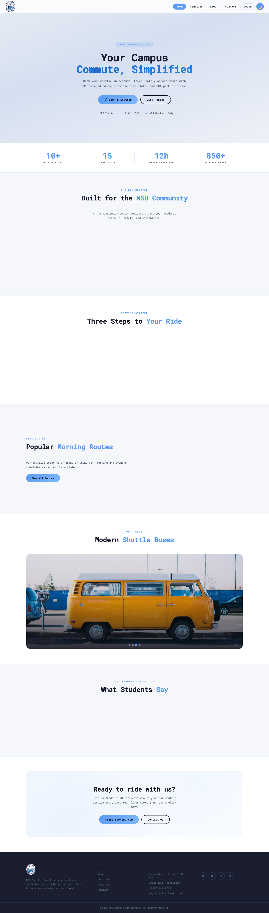
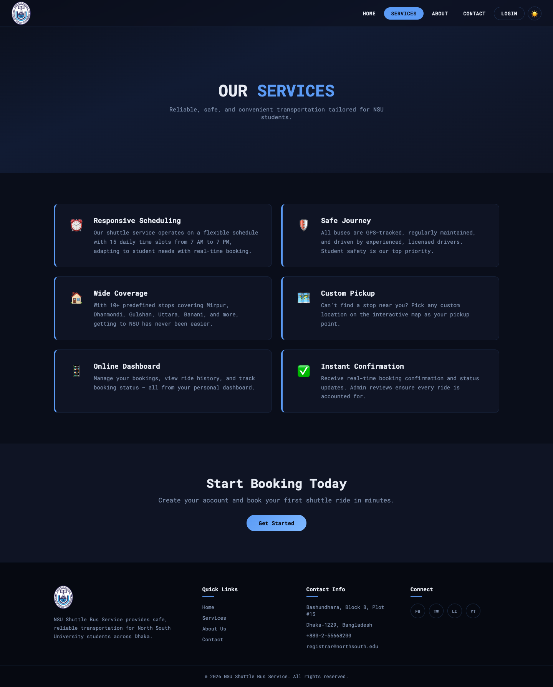
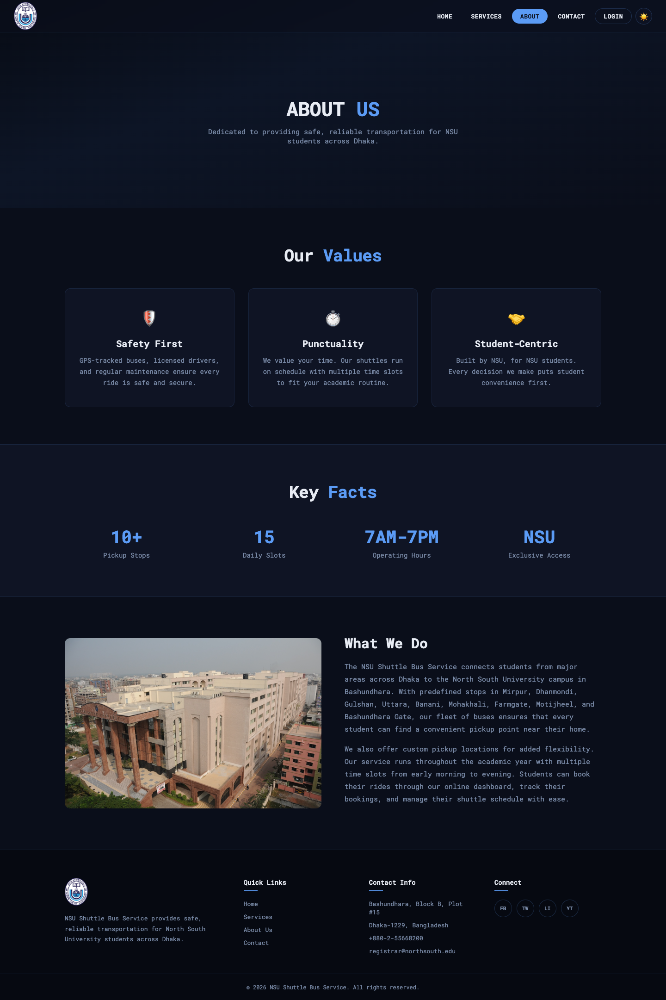
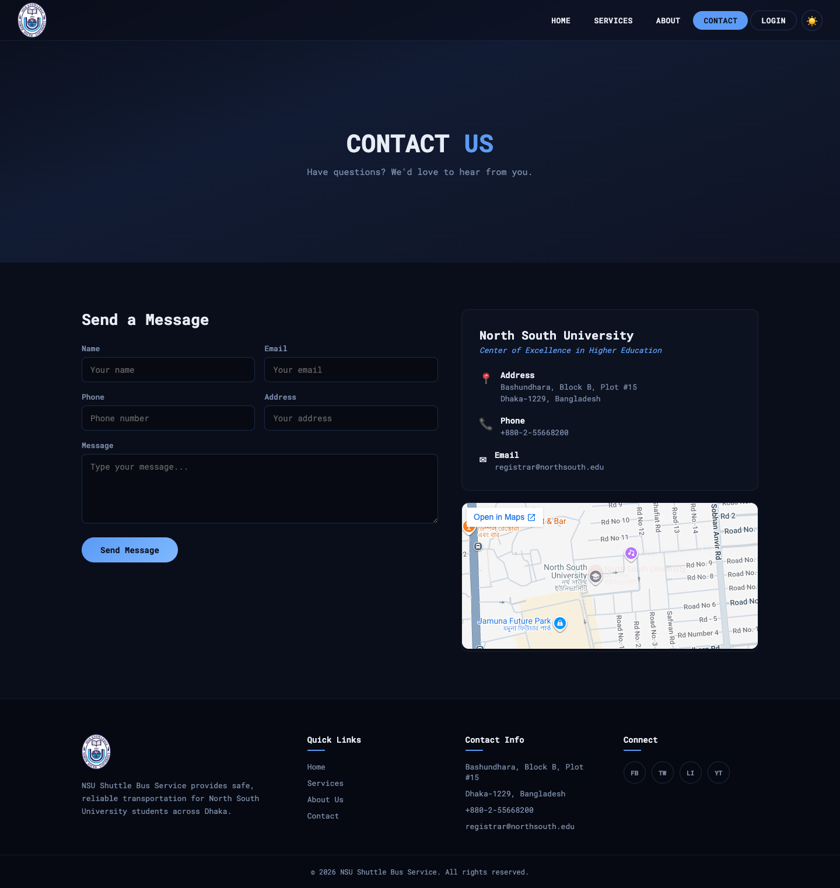
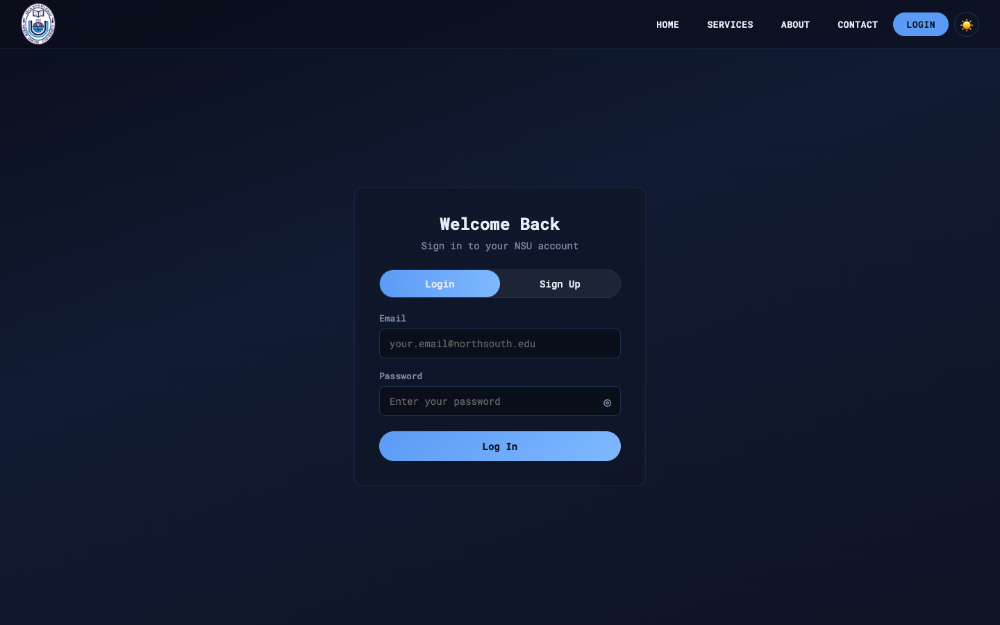
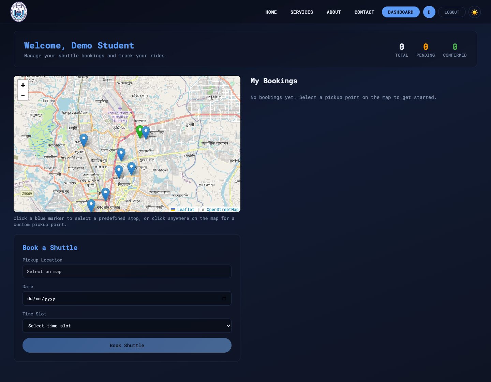
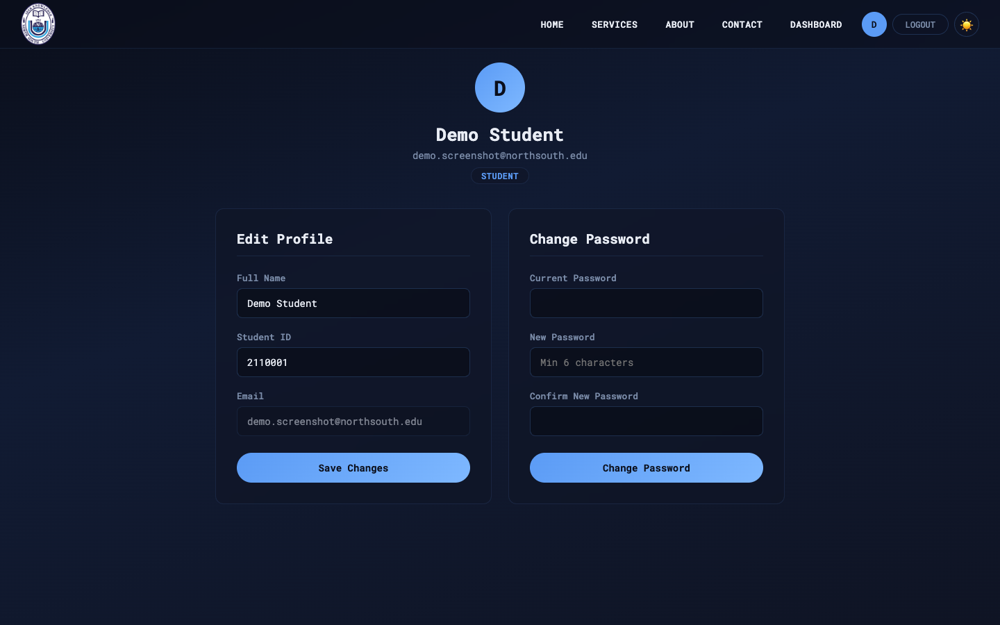
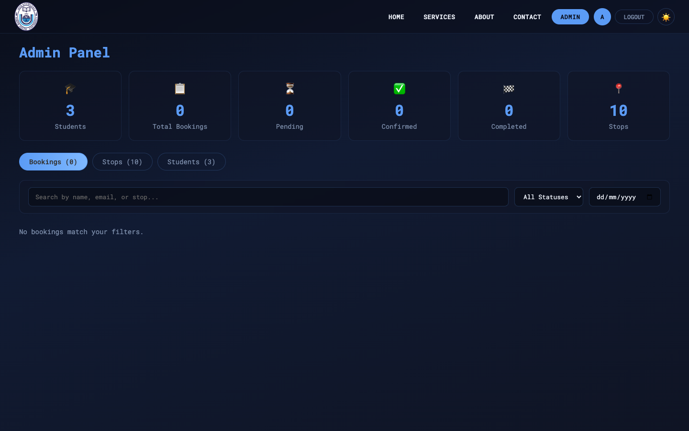
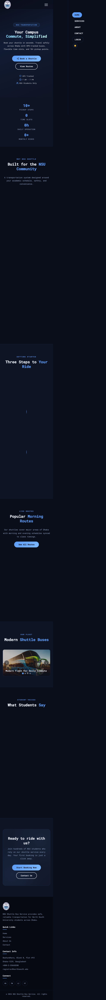

A full-stack shuttle bus booking system for **North South University** students. Book rides across Dhaka with an interactive map, flexible time slots, and real-time booking management.



---
## Applications


# NSU Shuttle Bus Service


## Demo

| Dark Mode | Light Mode |
|-----------|------------|
|  |  |

---

## Features

### Student Portal
- Register & login with `@northsouth.edu` email
- Interactive Leaflet map with **10+ predefined pickup stops** across Dhaka
- Custom pickup location by clicking anywhere on the map
- Book shuttles by **date + time slot** (7:00 AM - 7:00 PM)
- View, track, and cancel bookings
- Edit profile and change password

### Admin Dashboard
- Overview stats (students, bookings, stops)
- Manage all bookings (confirm, complete, cancel)
- Search & filter by name, email, stop, status, or date
- Add / delete shuttle stops
- View all registered students

### General
- Dark / Light theme toggle
- Mobile-responsive design
- Toast notifications
- Image slider fleet gallery
- Contact form

---

## Screenshots

### Services & About
| Services | About |
|----------|-------|
|  |  |

### Contact & Login
| Contact | Login |
|---------|-------|
|  |  |

### Student Dashboard


### Profile & Admin Panel
| Profile | Admin |
|---------|-------|
|  |  |

### Mobile Responsive
<p align="center">
  
</p>

---

## Tech Stack

| Layer | Technology |
|-------|------------|
| Frontend | React 18, React Router 6, Vite |
| Backend | Node.js, Express |
| Database | SQLite3 (better-sqlite3) |
| Auth | JWT + bcrypt |
| Maps | Leaflet + React Leaflet |
| HTTP | Axios |
| Font | Roboto Mono |

---

## Project Structure

```
NSU-Shuttle-Bus-Service/
├── client/                     # React frontend (Vite)
│   ├── public/img/             # Static images
│   └── src/
│       ├── components/         # Navbar, Footer, HeroHeader, ImageSlider,
│       │                       # BookingCard, BookingForm, BookingModal,
│       │                       # MapPicker, ProtectedRoute
│       ├── context/            # AuthContext, ToastContext, ThemeContext
│       ├── pages/              # Home, Login, Services, About, Contact,
│       │                       # Dashboard, Admin, Profile
│       ├── styles/             # Toast.css
│       ├── utils/              # api.js (Axios instance)
│       ├── App.jsx
│       └── App.css             # Design tokens & global styles
│
├── server/                     # Express backend
│   ├── db/
│   │   ├── database.js         # SQLite schema
│   │   └── seed.js             # Seed admin + 10 Dhaka stops
│   ├── middleware/
│   │   └── auth.js             # JWT auth + admin guard
│   ├── routes/
│   │   ├── auth.js             # Register, login, profile, password
│   │   ├── bookings.js         # CRUD bookings
│   │   ├── stops.js            # CRUD stops
│   │   ├── admin.js            # Stats + student list
│   │   └── contact.js          # Contact form
│   ├── __tests__/
│   │   └── api.test.js         # 47 unit tests
│   └── index.js                # Express entry point
│
└── package.json                # Root scripts
```

---

## Getting Started

### Prerequisites
- Node.js **18+**
- npm

### 1. Clone
```bash
git clone https://github.com/Moniruzzaman-Shawon/NSU-Shuttle-Bus-Service.git
cd NSU-Shuttle-Bus-Service
```

### 2. Install dependencies
```bash
npm run install-all
```

### 3. Seed the database
```bash
npm run seed
```

This creates:
- **Admin:** `admin@northsouth.edu` / `admin123`
- **10 pickup stops:** Mirpur 10, Dhanmondi 27, Gulshan 1, Uttara Sector 3, Banani Chairmanbari, Mohakhali Bus Stand, Farmgate, Motijheel, Bashundhara Gate, NSU Campus

### 4. Run development servers
```bash
npm run dev
```

| Service | URL |
|---------|-----|
| Frontend | http://localhost:5180 |
| Backend | http://localhost:3001 |

---

## Production Deployment

```bash
npm run build    # Builds React app
npm start        # Starts Express server (serves frontend + API)
```

Set environment variable: `NODE_ENV=production`

The database auto-seeds on first startup.

---

## API Endpoints

| Method | Endpoint | Auth | Description |
|--------|----------|------|-------------|
| POST | `/api/auth/register` | - | Register with NSU email |
| POST | `/api/auth/login` | - | Login |
| GET | `/api/auth/me` | JWT | Get current user |
| PATCH | `/api/auth/profile` | JWT | Update name + student ID |
| PATCH | `/api/auth/password` | JWT | Change password |
| GET | `/api/stops` | JWT | List all stops |
| POST | `/api/stops` | Admin | Add a stop |
| PUT | `/api/stops/:id` | Admin | Update a stop |
| DELETE | `/api/stops/:id` | Admin | Delete a stop |
| GET | `/api/bookings` | JWT | List bookings |
| POST | `/api/bookings` | JWT | Create a booking |
| PATCH | `/api/bookings/:id` | JWT | Update booking status |
| GET | `/api/admin/stats` | Admin | Dashboard statistics |
| GET | `/api/admin/students` | Admin | List all students |
| POST | `/api/contact` | - | Submit contact form |

---

## Database Schema

### users
| Column | Type | Notes |
|--------|------|-------|
| id | INTEGER | Primary key |
| name | TEXT | Full name |
| email | TEXT | Unique, `@northsouth.edu` |
| student_id | TEXT | Optional, 7 digits |
| password_hash | TEXT | bcrypt hash |
| role | TEXT | `student` or `admin` |
| created_at | DATETIME | Auto-generated |

### stops
| Column | Type | Notes |
|--------|------|-------|
| id | INTEGER | Primary key |
| name | TEXT | Stop name |
| lat | REAL | Latitude |
| lng | REAL | Longitude |
| area_name | TEXT | Area / district |

### bookings
| Column | Type | Notes |
|--------|------|-------|
| id | INTEGER | Primary key |
| user_id | INTEGER | FK → users |
| stop_id | INTEGER | FK → stops (nullable) |
| custom_lat | REAL | Custom latitude (nullable) |
| custom_lng | REAL | Custom longitude (nullable) |
| custom_address | TEXT | Custom description (nullable) |
| booking_date | TEXT | Ride date |
| time_slot | TEXT | 7:00 AM - 7:00 PM |
| status | TEXT | pending, confirmed, completed, cancelled |
| created_at | DATETIME | Auto-generated |

### contact_messages
| Column | Type | Notes |
|--------|------|-------|
| id | INTEGER | Primary key |
| name | TEXT | Sender name |
| email | TEXT | Sender email |
| phone | TEXT | Optional |
| address | TEXT | Optional |
| message | TEXT | Message body |
| created_at | DATETIME | Auto-generated |

---

## Scripts

| Command | Description |
|---------|-------------|
| `npm run dev` | Start client + server |
| `npm run client` | Start frontend only |
| `npm run server` | Start backend only |
| `npm run build` | Production build |
| `npm start` | Start production server |
| `npm run seed` | Seed database |
| `npm run install-all` | Install all dependencies |
| `cd server && npm test` | Run 47 unit tests |

---

## Testing

```bash
cd server && npm test
```

**47 tests** covering all API endpoints — auth, bookings, stops, admin, contact, and middleware.

---

## Author

**Moniruzzaman Shawon**

Built for North South University students.
